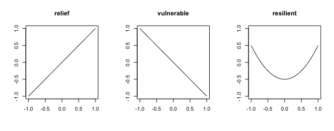
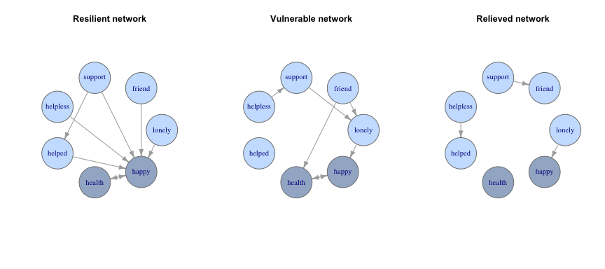
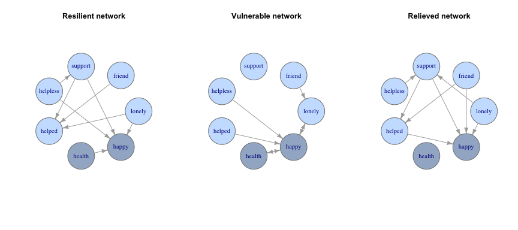
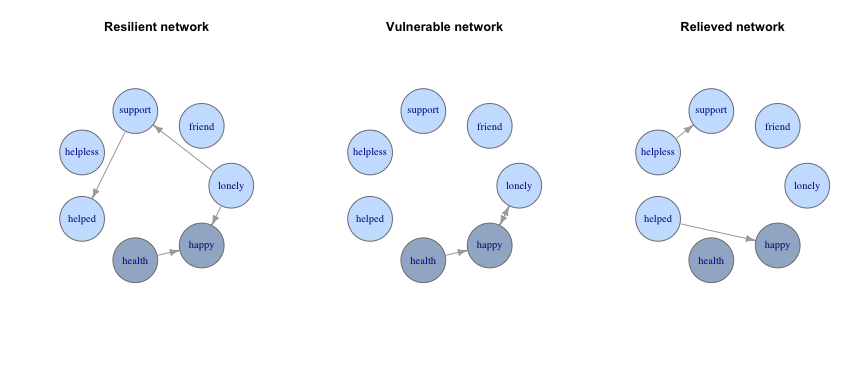

Social support network structure determines resilience to personal
disasters
================
Richard Morris
31 October, 2020

## Introduction

This is an extension of our paper titled [“The Differential Impact of
Major Life Events on Cognitive and Affective
Wellbeing”](https://www.sciencedirect.com/science/article/pii/S2352827319302204).
That paper described the average response to different life-events
described in [HILDA](https://melbourneinstitute.unimelb.edu.au/hilda),
with the worst events being *divorce, bankruptcy or loss of a spouse*.
There we saw that the average response to the worst life events was a
resilient u-shaped response in happiness levels, i.e., on average,
happiness recovered to the prior baseline.

This report takes the three worst life-events identified in our previous
work (*bankruptcy, divorce, loss*), and identifies three different
response-types to those events, i.e., subgroups within the average
response, determined by parametric analysis: 1) **resilient**,
representing the average response (u-shaped); 2) **vulnerable**,
representing a decreasing change in happiness around or after the event;
or 3) **relieved**, representing a positive change in happiness around
or after the event.

##### Figure 1. Response types to bad events

<!-- -->

Figure 1 above shows the three different response types to life-events.

We examine the **social support networks** among the three different
subgroups of people which display each response. HILDA offers a variety
of variables measuring social support, including:

1.  Loneliness (Agreement with ‘I often feel very lonely’)
2.  Friendless (Agreement with ‘I don’t have anyone to confide in’)
3.  Unsupported (Agreement with ‘I have no one to lean on in times of
    trouble’)
4.  Helpless (Agreement with ‘I often need help from people but can’t
    get it’)
5.  Helped (Agremeent with ‘When I need someone to help me I can usually
    find someone’)

We also examined *health* (satisfaction with health) and *happiness*
(sum of SF-36 item 9).

Other variables which may be included in the future include “feeling
part of your local community” (`losatlc`), satisfaction with job
security (`jbmssec`), and household net worth (`hwnwip`). See the [HILDA
data
dictionary](https://www.online.fbe.unimelb.edu.au/HILDAodd/srchVarnameUsingCategoriesCrossWave.aspx)
for explanations of these variables.

The time-varying dependencies among the social support variables over
sixteen years were determined in a **Bayesian network**. Bayesian
networks are a *graphical* model which represent the joint probability
distribution between the variables of interest. Graphical models
represent variables of interest as nodes and the associations between
them as arcs or edges. In a Bayesian network, the edges represent the
conditional probability of a node given it’s parent. A node may be
conditionally dependent on a number of parent nodes, and also be
associated with a number of child nodes. That is, a node may be a child
of an upstream variable and a parent of a downstream variable.
***Dynamic* Bayesian networks** extend this fundamental idea to
variables that are represented by nodes over time (i.e., a single
variable measured at successive time points). When multiple variables
are included, the result is a multivariate time-series. Within the
multivariate time series, variables at the same time point cannot
influence each other, or nodes at earlier time points; this guarantees
the acyclicity of the graph (the Causal Markov Assumption). The
unidirectional effect of time prevents feedback loops and is consistent
with a causal interpretation of the resulting graph (Pearl, 2009).

HILDA provides a multivariate time series for our variables of interest
from 2001 to 2016. To learn the dynamic Bayesian network amoung our
social support variables for each group (resilient, vulnerable and
relieved), we used the developer version of the
[EDISON](https://github.com/FrankD/EDISON) package. This version has
updates to the matrix operations to significantly increase speed and
improve performance.

    # Installing the developer version of EDISON:
    devtools::install_github(repo='FrankD/EDISON', 
                             ref='MultipleTimeSeries', 
                             subdir='/Package/EDISON')

#### Bankruptcy

<!-- -->

 

The maximum connectedness of the resilient graph was 7, and the most
interconnected variables (with the largest number of edges) were
happy:7, support:2, helped:2, health:2, lonely:1, friend:1, helpless:1.

The maximum connectedness of the vulnerable graph was 3, and the most
interconnected variables (with the largest number of edges) were
lonely:3, health:3, happy:3, friend:2, support:2, helpless:1, helped:0.

The maximum connectedness of the resilient graph was 1, and the most
interconnected variables (with the largest number of edges) were
lonely:1, friend:1, support:1, helpless:1, helped:1, happy:1, health:0.

 

#### Divorce

<!-- -->

 

The maximum connectedness of the resilient graph was 4, and the most
interconnected variables (with the largest number of edges) were
happy:4, support:3, helped:3, lonely:2, helpless:2, friend:1, health:1.

The maximum connectedness of the vulnerable graph was 6, and the most
interconnected variables (with the largest number of edges) were
happy:6, lonely:3, health:2, friend:1, helpless:1, helped:1, support:0.

The maximum connectedness of the resilient graph was 4, and the most
interconnected variables (with the largest number of edges) were
support:4, happy:4, helped:3, lonely:2, friend:2, helpless:1, health:0.

 

#### Death of partner

<!-- -->

 

The maximum connectedness of the resilient graph was 2, and the most
interconnected variables (with the largest number of edges) were
lonely:2, support:2, happy:2, helped:1, health:1, friend:0, helpless:0.

The maximum connectedness of the vulnerable graph was 3, and the most
interconnected variables (with the largest number of edges) were
happy:3, lonely:2, health:1, friend:0, support:0, helpless:0, helped:0.

The maximum connectedness of the resilient graph was 1, and the most
interconnected variables (with the largest number of edges) were
support:1, helpless:1, helped:1, happy:1, lonely:0, friend:0, health:0.

 
